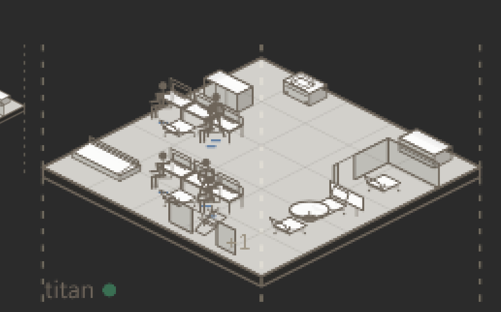

# AI Office Dollhouse

AI Office Dollhouse is a small read-only Windows overlay that turns lifecycle events from local Codex, Claude, Gemini and Grok sessions into an original 2.5D office. It gives you a quick sense of what is running, which sessions are waiting for input, where subagents are active and when work has finished, while the animated office makes long tool runs and build waits a little less dull.



The app does not start agents, dispatch tasks or call a model. It observes structured lifecycle hooks already emitted on your machine and stores only a narrow allowlist of metadata, so prompts, responses, commands and credentials stay outside the display pipeline.

## What you can see

- Active, waiting, discussing, completed and cancelled work based on lifecycle evidence
- A dedicated floor for each session that has subagents, with ordinary work sharing a common office floor
- A permanent Owner role and an Owner floor that appears only when a real decision needs attention
- Up to six visible people on each floor, with an exact `+N` count when a real team is larger
- Full motion, reduced motion, do-not-disturb and important-events-only modes
- A transparent always-on-top window with click-through drawing areas, DPI awareness and automatic resource-pressure fallback

Simply leaving an agent app open does not make anyone appear busy. Process presence can support an uncertain state, but only lifecycle events can show actual work or completion.

## Install on Windows

AI Office Dollhouse supports Windows 10 and 11 and requires Microsoft Edge WebView2 Runtime.

1. Download the latest `AI-Office-Dollhouse-*-win-x64.zip` from [GitHub Releases](https://github.com/leavemagic-cyber/ai-office-dollhouse/releases)
2. Extract the complete archive
3. Run `Install-AI-Office-Dollhouse.cmd`
4. Open **AI Office Dollhouse** from the desktop or Start menu

The installer places the app in `%LOCALAPPDATA%\Programs\AI Office Dollhouse`, creates shortcuts with the project icon and merges the required lifecycle hooks after making backups. Existing hooks from other tools are preserved, while Codex may still ask you to review and trust its new hook once.

Close the app before running `Uninstall-AI-Office-Dollhouse.cmd`. Uninstalling removes this project's hooks, relay, shortcuts and program files, while local event data remains under `%LOCALAPPDATA%\AIOfficeDollhouse` so an update or removal does not erase an active record unexpectedly.

## Run from source

Node.js 22 or newer is required.

```powershell
npm.cmd ci
npm.cmd run start
```

Run the complete verification and Windows packaging flow with:

```powershell
npm.cmd test
npm.cmd run check
npm.cmd run test:soak
npm.cmd run package:win
```

## Privacy boundary

Stored events may contain hashed session and agent identifiers, provider names, event types, tool names and only the final segment of a working directory. Full paths, command lines, account details, tokens, API keys, prompts, model responses and transcript content are never written to the event store.

The app has no model API calls and does not control external agent processes. Read [Privacy](docs/PRIVACY.md) and [Provider integrations](docs/INTEGRATIONS.md) for the complete boundary.

## Where this project fits

[Pixel Agents](https://github.com/pixel-agents-hq/pixel-agents) and [Claude Office](https://github.com/paulrobello/claude-office) offer broader office simulations and interactive surfaces. AI Office Dollhouse takes a narrower path as a compact, local-first observer that can stay in a corner of the Windows desktop without becoming another control panel.

All code, artwork, icons and text in this repository were created independently. The project does not reuse sprites, layouts or README copy from those repositories.

## Documentation

- [Architecture and display truth](docs/ARCHITECTURE.md)
- [Testing and performance](docs/TESTING.md)
- [Provider integrations](docs/INTEGRATIONS.md)
- [Release checklist](docs/RELEASE_CHECKLIST.md)
- [Security policy](SECURITY.md)

## License and names

The source code is available under the MIT License. Codex, Claude, Gemini and Grok are mentioned only to describe compatible interfaces, while this project is neither affiliated with nor endorsed by their providers and includes none of their logos, characters or branded artwork.
